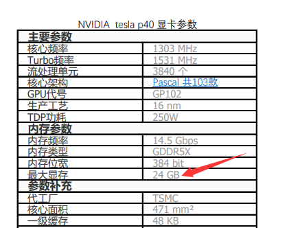
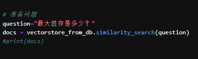
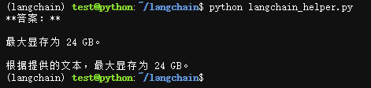

- 文档内容


- 问题


- 问答结果


## 使用方法
```bash
git clone https://github.com/bifu123/langchain
cd langchain
conda create -n langchain python=3.11
conda activate langchain
pip install -r requirements.txt -i https://pypi.tuna.tsinghua.edu.cn/simple
```

## 注意事项
```python
oembed_server = OllamaEmbeddings(base_url="http://192.168.66.24:11434", model="nomic-embed-text")
ollama_server = Ollama(base_url='http://192.168.66.26:11434', model="gemma:7b")
```
为内建的ollama服务器，详情参见ollama文档


