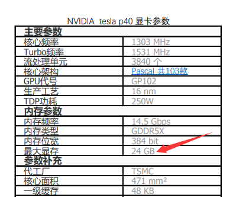
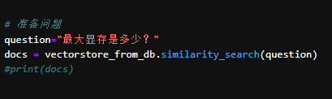
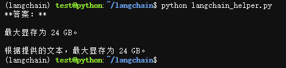

- 结构示意


- 文档内容


- 问题


- 问答结果


## 使用方法
```bash
git clone https://github.com/bifu123/langchain
cd langchain
conda create -n langchain python=3.11
conda activate langchain
pip install -r requirements.txt -i https://pypi.tuna.tsinghua.edu.cn/simple
```
- 配置文件
编辑config.py
```python
oembed_server = OllamaEmbeddings(base_url="http://192.168.66.24:11434", model="nomic-embed-text")
ollama_server = Ollama(base_url='http://192.168.66.26:11434', model="gemma:7b")
```
oembed_server、ollama_server 为内建的ollama服务器，详情参见ollama文档:<br>
ollama入门：https://github.com/ollama/ollama <br>
ollama文档：https://github.com/ollama/ollama/tree/main/docs

- 量化文档
```bash
python embed_docs.py
```

- 执行问答
```bash
python langchain_helper.py
```

- 文档管理
```bash
python main.py
```
然后访问 http://ip:8001
*** 上传或删除文档时都会触发自动量化文档 ***

## 交流讨论
QQ号：415135222
QQ群：222302526 